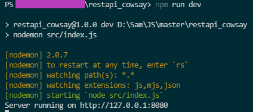
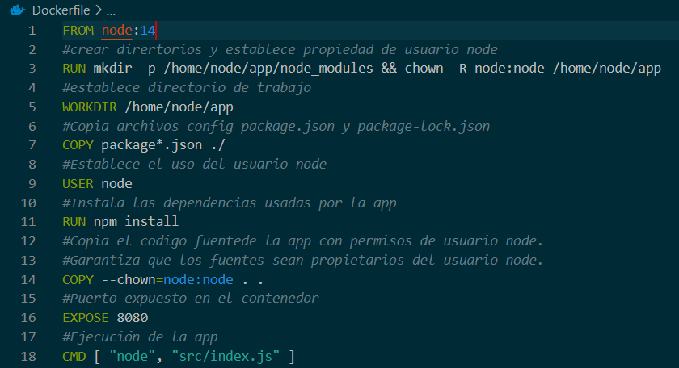

# API Rest para WebDevs (express, cowsay)

La aplicación consiste en un ejercicio sencillo de una API Rest con Nodejs utilizando librerías express, cowsay, morgan y nodemon.
El ejercicio consta de una petición `GET`, la cual devolverá un mensaje y pequeño diseño con cowsay.<br>
Adicional, se anexa instrucción para uso de Docker.
## Requisitos.
----
### Tener instalados: 
`Node`<br>
`Docker`
<br>

## 1. Ejecución local.
----
### 1.1. Clonar el repositorio.
Colocate en la carpeta donde desees clonar el repositorio.
```bash
git clone https://github.com/salvareze/restapi_cowsay.git
```
### 1.2. Instalar dependencias de npm.
Por medio de la terminal en lel path del proyecto procedemos a instalar las dependencias:
```bash
npm install
```
Si todo se encuentra correcto, deberá tener una nueva carpeta con las librerías descargadas de manera local `node_modules/`.
### 1.3. Ejecutar aplicación
El ejemplo esta configurado para ejecutar de dos maneras:
#### 1.3.1  Utilizando el comando genérico de Nodejs
El comando generico es `node` seguido de la ruta y/o nombre del archivo JS:
```bash
node src/index.js
```
<br>
#### 1.3.2  Utilizando "nodemon" el cual ejecuta npm por medio de un alías configurado en el package.json. 
Comando `npm` seguido de `run` y el alías, en este ejemplo `'dev'`.
```bash
npm run dev
```
<br>
<br>Nota: Se suele utilizar cuando se tiene una estructura amplia.
#### 1.4. Abre tu navegador o el Postman en http://localhost:8080/
Deberás visualizar:<br>


#### 1.4. Detener la aplicación.
Para detener el servidor teclea: `CTRL`+`C`.
<br>

## 2. Docker
----
### 2.1. Dockerfile.
Para este ejercicio se utiliza el siguiente `Dockerfile`

### 2.2. Crear image
Ejecutar en la terminal el comando `docker build` 
```bash
docker build . -t <user>/<image_name>
```
Ejemplo:
```bash
docker build . -t saesc/restapi_cowsay
```
<li> `.` : Especifica que el contexto de la compilación es el directorio actual.</li>
<li> `-t` : Etiqueta la imagen con un nombre/alías.</li>
<li> `user` : Se suele utilizar el usuario creado en DockerHub.</li>
<li> `image_name` : Nombre de la image./li>

### 2.3. Creación y uso de contenedor basada en la image. 
Ejecutar en la terminal el comando `docker run` 
```bash
docker run -d -p <port_host>:<port_vm> <user>/<image_name>
```
Ejemplo:
```bash
docker run -d -p 3000:8080 saesc/restapi_cowsay
```
<li> `-d` : Evita que se visualice la terminal del servidor.</li>
<li> `-p` : Asigna puerto local para acceder al puerto interno del servidor.</li>
<li> `port_host` : Puerto local.</li>
<li> `port_vm` : Puerto interno.</li>

Una vez arrancado el servidor se podrá hacer uso de ella por medio del puerto asignado:


### 2.3.1 DockerHub. 
Docker tiene su propio repositorio.<br>
El ejercicio usado se encuentra actualmente en la nube por lo que se puede descargar y/o solo hacer uso de la image directamente.  <br>
Descarga de contenedor:
```bash
docker pull saesc/restapi_cowsay
```
Arranque:
```bash
docker run -d -p 3000:8080 --name saesc saesc/restapi_cowsay
```
### 2.4 Comandos extras.
Puede comprobar sus contenedores en ejecución:
```bash
docker ps
```


Para detener la ejecución utilice el `CONTAINER ID`:
```bash
docker stop 1906b66a36b5
```


